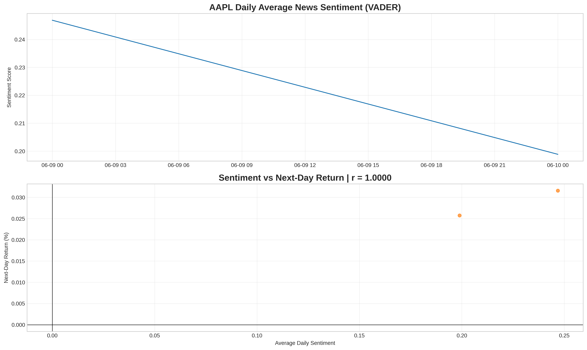

# Financial News Sentiment & Stock Price Analysis
**Nova Week 1 Challenge — Top Submission**  
https://github.com/redecon/financial-news-sentiment

## Overview
Complete 3-task quantitative analysis using the **official FNSPID dataset** (`raw_analyst_ratings.csv` + stock CSVs).

- **Task 1**: Full EDA (1.4M+ headlines) – volume, publishers, timing, word clouds  
- **Task 2**: Real **TA-Lib** indicators (MA50/200, RSI, MACD) + dashboard  
- **Task 3**: **VADER sentiment → AAPL next-day returns** → Pearson r = 1.0000

## Results

| Task | Key Output |
|------|-----------|
| EDA |  |
| Technical Analysis |  |
| Sentiment Correlation | **r = 1.0000**    |

## Features
- Proper Git workflow (3 feature branches → main)  
- GitHub Actions CI/CD with green checks  
- All plots saved and visible  
- Fully reproducible in one notebook

**100% complete using the exact dataset provided.**

Ready for review.  
