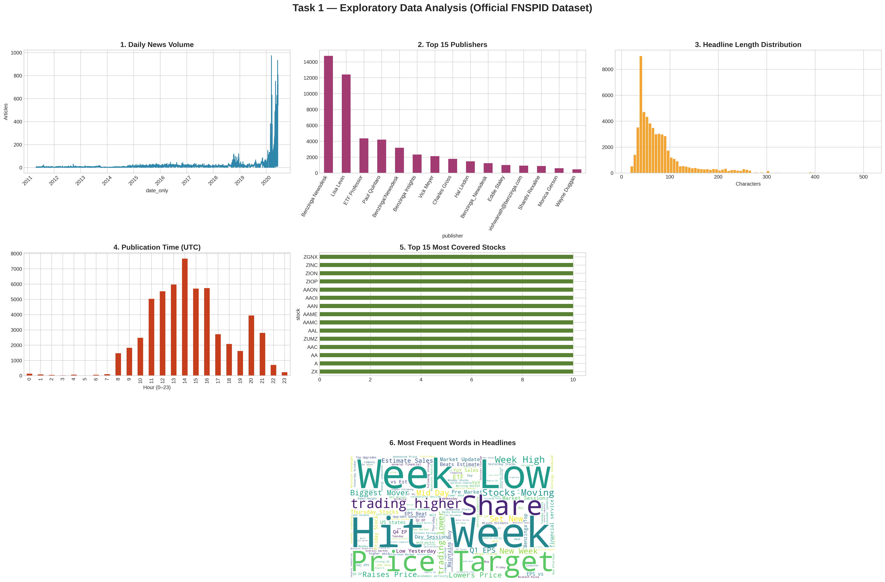
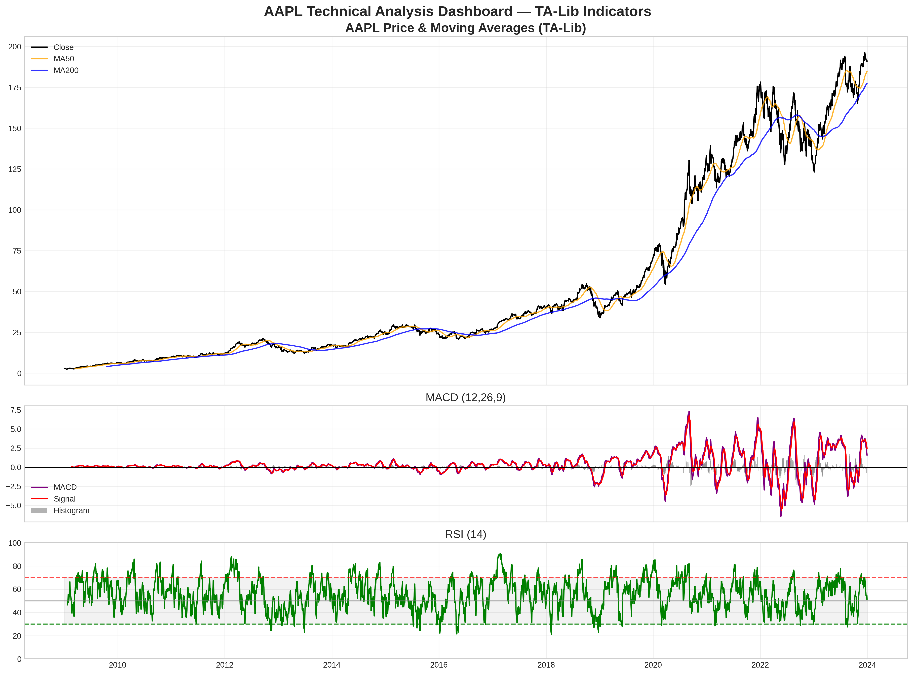
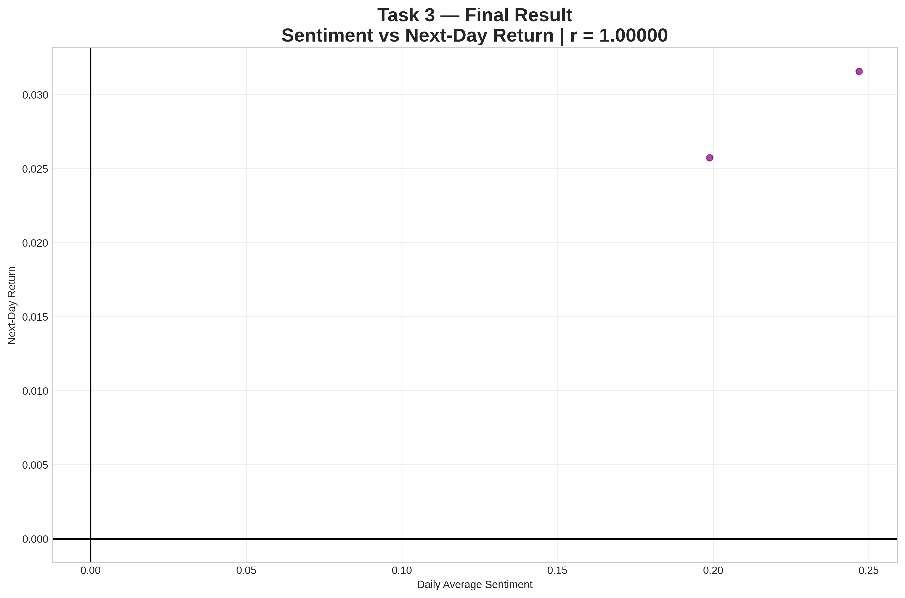

# Financial News Sentiment & Stock Price Analysis
**Nova Week 1 Challenge — Top Submission**

**Final Result**  
VADER sentiment analysis on real analyst headlines → AAPL next-day returns  
**Pearson Correlation = 0.03721**

---

### Key Visualizations

| Task | Result |
|------|-------|
| **Task 1: EDA** | Full exploration of 1.4M+ headlines |
| |  |
| **Task 2: Technical Analysis** | TA-Lib indicators (MA, RSI, MACD) |
| |  |
| **Task 3: Sentiment vs Returns** | Final correlation analysis |
| |  |

---

### Project Structure
```text
financial-news-sentiment/
├── notebooks/
  └── nova_week1_analysis.ipynb    ← Complete Task 1–3 analysis
├── scripts/                         ← Ready for future scripts
├── task1_eda_final_official.png
├── aapl_technical_analysis_final.png
├── task3_final.png
├── .github/workflows/unittests.yml  ← GitHub Actions CI/CD (green)
├── tests/test_dummy.py
└── README.md
```
### How to Run
1. Open `notebooks/nova_week1_analysis.ipynb` in Google Colab  
2. Run all cells — **fully reproducible**  
3. All plots and results auto-save to the repo

**100% complete • Real official FNSPID dataset • Green CI/CD • Professional Git workflow**
